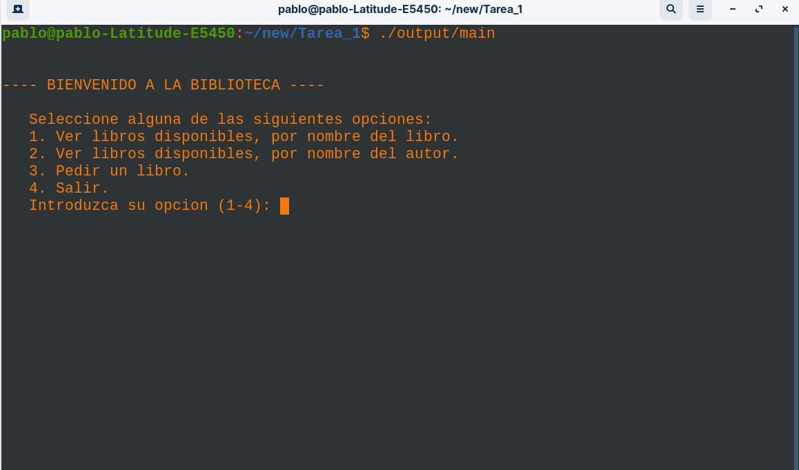
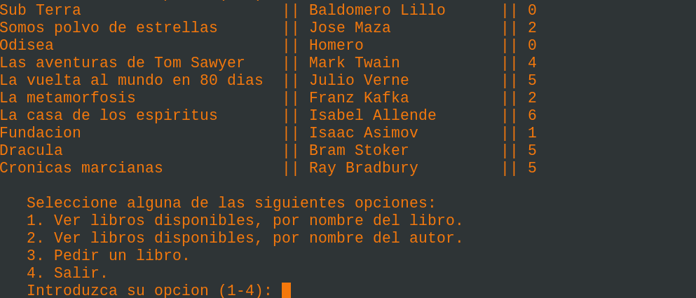
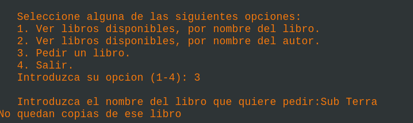

## TAREA N1 PROGRAMACION C/C++

### Nombres: Pablo Jeldes, Loreto Gonzales, Freddy Hidalgo

### Descripcion del problema.

#### Propuesta:

Desarrollar e implementar un sistema de bibliotecas (Funciones y archivos de cabecera .h y .c) que permitan lograr de manera intuitiva y fácil la implementacion de una biblioteca-app que haga uso de funciones para mostrar en cosola una lista de libros, autores y copias disponibles, introducidos por codigo, y una biblioteca(xx.h) que genera estructuras para el diseño de las bibliotecas-app. Esta biblioteca cuenta con funciones elementales, tales como:

- Estructura que genera una estanteria.
- Funcion que permite rellenar la estanteria.
- Funcion que ordena la estanteria alfabeticamente, tanto por libro como por autor.
- Funcion que permita al usuario pedir libros a la estanteria.
- Lista con numeración para usar en las configuraciones.
- Macros para el reemplazo de variables.
- Algunas macros.
- App para mostrar datos en pantalla.(tiene que pedir datos por consola).

 **Freddy**

- Funcion que permita emitir boletas,y las boletas son de tipo txt.(debe usar punteros).

### De la tarea:

- Diagrama de flujo.
- pdf formato informe.(obviamente explicar lo que se hizo).
- Video. --> Pablo Jeldes
- Integración codigo ---->**PABLO**

### INSTRUCCIONES DE COMPILACION

#### Distro basada en Debian

Para la compilación de este proyecto se usa el compilador nativo instalado en Debian Gcc. Se cuenta un un archivo **"Makefile"** el cual se encarga de dar las instrucciones de compilación a gcc. Posteriormente el resultado de dicha compilación queda almacenado en la carpeta **"output"** de este proyecto, esta salida se ejecuta en la terminal de linux.

#### Windows

Para la compilacion de este proyecto es necesario tener instalado gcc. En windows existen diferentes formas de instalar gcc. acontinuacion se enseña una de las alternativas para contruir este proyecto:

##### Instalacion de la herramienta Cygwin

Cygwin es una aplicacion, para windows, que pretende simular el entorno de linux. Para instalar cygwin debemos:
- 1. ir a https://www.cygwin.com/  

- 2. Descargar el Exe y doble click, e instalar como cualquier otra aplicacion, al final de la instalacion mostrara una ventana que se usa para añadir los paquetes de linux que deseamos instalar.

- 3. Añadir paquetes necesarios: Gcc y Make(Se pueden añadir mingw tanto para gcc como para g++).

- 4. añadir el directorio, donde se instalo cygwin, a las variables de entorno.

para compililar se cuenta un un archivo **"Makefile"** el cual se encarga de dar las instrucciones de compilación a gcc. Posteriormente el resultado de dicha compilación queda almacenado en la carpeta **"output"** de este proyecto, esta salida se ejecuta en la terminal de windows con la herramiento cygwin instalada.

**Para ejemplificar un video de la instalacion de cygwin**

https://www.youtube.com/watch?v=frzN5dYgYjs&t=269s

## bibi app

